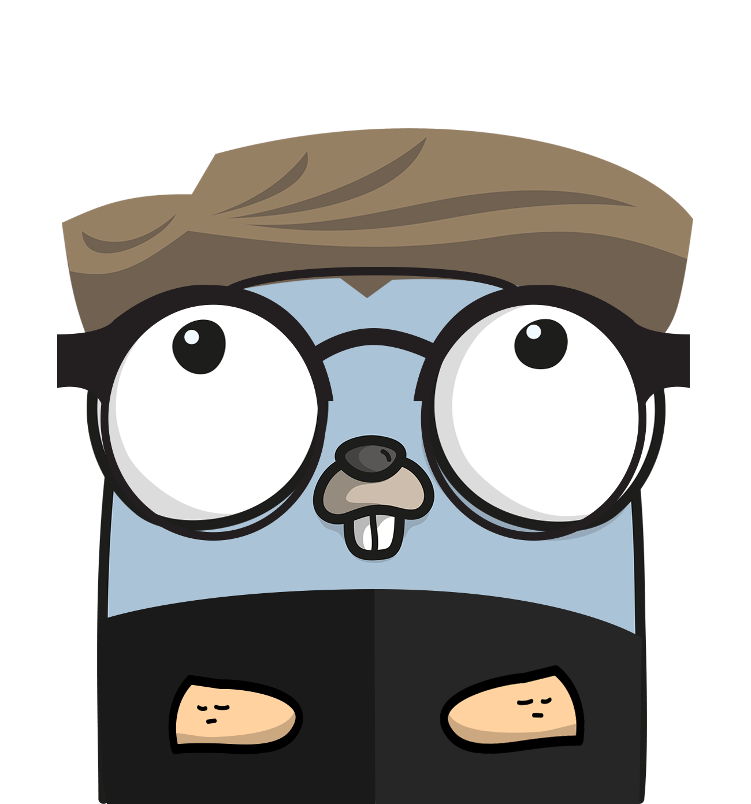

# smock

[](https://github.com/becheran/smock/actions/workflows/go.yml)
[![Go Report Card][go-report-image]][go-report-url]
[![PRs Welcome][pr-welcome-image]][pr-welcome-url]
[![License][license-image]][license-url]

[license-url]: https://github.com/becheran/smock/blob/main/LICENSE
[license-image]: https://img.shields.io/badge/License-MIT-brightgreen.svg
[go-report-image]: https://goreportcard.com/badge/github.com/becheran/smock
[go-report-url]: https://goreportcard.com/report/github.com/becheran/smock
[pr-welcome-image]: https://img.shields.io/badge/PRs-welcome-brightgreen.svg
[pr-welcome-url]: https://github.com/becheran/smock/blob/main/CONTRIBUTING.md

Simple and fast mock generator for golang



## Features

Mocking interfaces for unit tests is a common task in *go* which can be done manually or using a generator which would automates the process of repeatably writing `structs` which fullfil the interfaces for testing.

There are at least two other popular mock generators that exist for *go* right now. The first is *mockgen* which is part of the [mock](https://github.com/golang/mock) module maintained by the *golang* team. The other is [mockery](https://github.com/vektra/mockery) which uses the [testify mock](https://pkg.go.dev/github.com/stretchr/testify/mock) interfaces.

So why "yet another mock generator"? Or in other words "what does *smock* offer that *mockgen* or *mockery* doesn't?"

It does not offer any features which are not yet covered by the existing libraries, but it simplifies the process of mocking *interfaces* manually without requiring any additional libraries or complex assertions. It does the most basic thing of allowing to do or assert arbitrary behavior of a interface which is passed to a function under test.

|| smock | mockery | testify
|-|-|-|-|
| Requires additional library | ❌ | ✅ |✅
| Original types on mocked functions | ✅ | ❌ |❌
| Complex assertions and tests of mock| ❌ | ✅ |✅

## Getting Started

Install latest version:

``` sh
go install github.com/becheran/smock
```

Annotate `interface` which shall be mocked:

``` go
//go:generate smock
type MockMeIfYouCan interface {
 Foo(bar int, baz string) (res int, err error)
}
```

Run the following command to generate mocks for all annotated interfaces:

``` sh
go generate ./...
```

All generated mocks will show up in the folder `mocks` of the module root next to the `go.mod` file. The import name for the generated mocks will be `<PackageNameOfInterface>_mock`.

The mocked interface can be used in unit tests. The mocks can act as all types of mocks as [martin fowler listed once](https://martinfowler.com/articles/mocksArentStubs.html).

### Dummy

Directly pass mock to consumer:

``` go
func TestMockMeIfYouCan(t *testing.T) {
 Consumer(foo_mock.NewMockMockMeIfYouCan(t))
}
```

### Stub

Return fixed answers:

``` go
func TestMockMeIfYouCan(t *testing.T) {
 mock := foo_mock.NewMockMockMeIfYouCan(t)
 mock.WHEN().Foo().Return(42, nil)
 Consumer()
}
```

### Spy

Assert arguments when being called:

``` go
func TestMockMeIfYouCan(t *testing.T) {
 mock := gomod_test_mock.NewMockMockMeIfYouCan(t)
 mock.WHEN().Foo().Do(func(bar int, baz string) (res int, err error) {
  if bar != 42 {
   t.Fatal("bar must be 42")
  }
  return
 })
 Consumer(mock)
}
```

### Mock

Do and return arbitrary stuff when being called:

``` go
func TestMockMeIfYouCan(t *testing.T) {
 mock := gomod_test_mock.NewMockMockMeIfYouCan(t)
 ctr := 0
 mock.WHEN().Foo().Do(func(bar int, baz string) (res int, err error) {
  ctr++
  if ctr > 2 {
   t.Fatal("shall only be called twice")
  }
  return ctr, nil
 })
 Consumer(mock)
}
```
